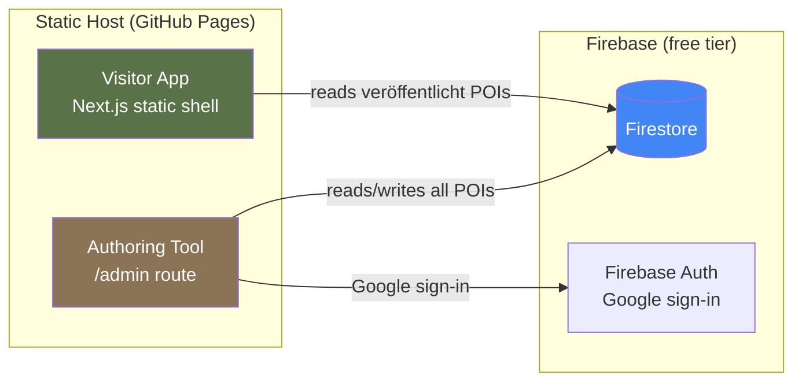
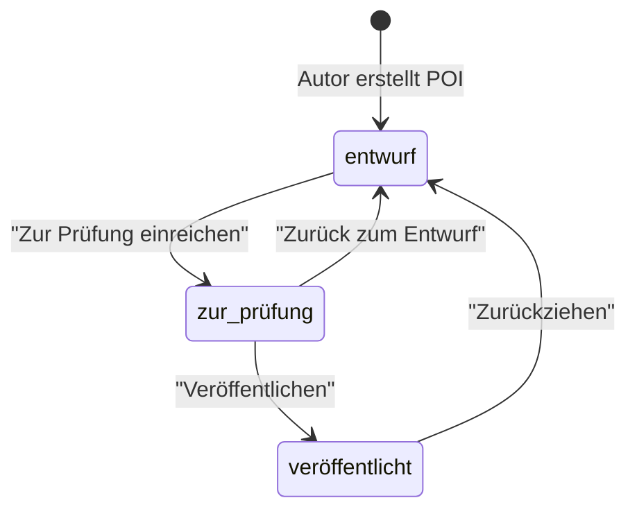

# POI Authoring Tool — Implementation Plan (v2)

## Goal

Add a web-based authoring tool so non-technical editors can create and edit POIs for the Südwestkirchhof Stahnsdorf map app. Use Firebase (free tier) as the backend. Published POIs appear on the live site immediately via Firestore reads — no build/deploy step needed.

This is the updated plan aligned with the new German-field schema (`docs/schema.md`).

## Design Decisions (confirmed)

| Entscheidung | Wahl |
|---|---|
| Auth | Google-Login, Whitelist in Firestore |
| Whitelist-Pflege | Via Firebase Console |
| Admin-Route | `/admin` im selben Next.js-Projekt |
| Rollen | Keine — jeder Whitelisted darf alles (erstellen, prüfen, veröffentlichen, zurücksetzen) |
| Publish-Workflow | `entwurf` → `zur_prüfung` → `veröffentlicht` (drei Stufen, keine Rolleneinschränkungen) |
| Datenquelle Besucher-App | Firestore-live (client-side reads, nur `publish_status == "veröffentlicht"`) |
| Static Export | Bleibt. Neue POIs über Karte erreichbar, Direkt-URLs erst nach Rebuild |
| Sprachen | de (Pflicht), en/fr/pl/ru/sv (KI-generiert, Backlog). Editor nur auf Deutsch |
| Schema | `docs/schema.md` — deutsche Feldnamen |
| Backup | JSON-Export/Import im Admin |
| Admin-UI | Desktop-first, Tabellenansicht mit Filtern, Zwei-Spalten-Editor |
| Typ-Anzeige | Gespeichert lowercase (`grab`), angezeigt mit Großbuchstabe (`Grab`) |
| Schema-Vereinfachung | Bewusste YAGNI-Entscheidung: `quellen` als Freitext, keine strukturierten Personenbezüge, `datum_von`/`datum_bis` als Universalfelder. Firestore ist schemalos — Felder können später ergänzt werden, ohne bestehende Daten zu migrieren. |
| Offline-Fähigkeit | Firestore Offline Persistence aktiviert — IndexedDB-Cache für Vor-Ort-Nutzung auf dem Friedhof |

## Backlog (nicht in v1)

- [ ] Scheduled Rebuilds (GitHub Action, z.B. täglich) — damit neue POIs Direkt-URLs bekommen
- [ ] KI-Übersetzungen via Gemini Flash (pl, ru, sv, en, fr)
- [ ] Email/Password-Auth
- [ ] Bildupload und -verwaltung
- [ ] Audit-Log / Änderungshistorie pro POI
- [ ] In-App Nutzerverwaltung (ohne Firebase Console)
- [ ] Automatisierte Backups nach Cloud Storage

## Architecture Overview



**Key architectural shift:** The visitor app currently reads from static `data/pois.json` at build time. With this change, it will fetch published POIs from Firestore at runtime (client-side). The app shell remains statically deployed — only the data is dynamic.

> [!IMPORTANT]
> **Offline-Robustheit:** Die Besucher-App wird vor Ort auf einem Waldfriedhof mit lückenhaftem Netz genutzt. Firestore Offline Persistence (`enableIndexedDbPersistence`) cacht gelesene Dokumente automatisch in IndexedDB. Beim zweiten Besuch funktioniert die App auch ohne Netzverbindung.

---

## Proposed Changes

### Component 1: Firestore Data Model

#### Structure

```
firestore/
├── pois/{poiId}
│   ├── id                         # string
│   ├── typ                        # "grab" | "mausoleum" | "denkmal" | "gedenkanlage" | "bauwerk" | "bereich"
│   ├── name                       # LocalizedText { de: "...", en?: "..." }
│   ├── koordinaten                # { lat: number, lng: number } | null
│   ├── kurztext                   # LocalizedText
│   ├── beschreibung               # LocalizedText
│   ├── datum_von                  # string | null ("YYYY-MM-DD")
│   ├── datum_bis                  # string | null ("YYYY-MM-DD")
│   ├── wikipedia_url              # string | null
│   ├── bilder                     # Bild[] (datei, nachweis, nachweis_url, beschriftung)
│   ├── audio                      # { [sprache]: string } — URL pro Sprache
│   ├── quellen                    # string[]
│   ├── status                     # "bestätigt" | "prüfen" (redaktionelle Qualität)
│   ├── notiz                      # string (intern, nicht in App)
│   │
│   ├── publish_status             # "entwurf" | "zur_prüfung" | "veröffentlicht"
│   ├── erstellt_von               # Google-Email
│   ├── erstellt_am                # Firestore Timestamp
│   ├── geaendert_von              # Email letzter Bearbeiter
│   └── geaendert_am               # Firestore Timestamp
│
├── collections/{collectionId}
│   ├── id, name, kurztext, beschreibung, pois, status, notiz
│   ├── publish_status
│   ├── erstellt_von / erstellt_am
│   └── geaendert_von / geaendert_am
│
└── config/editors/{email}         # Ein Dokument pro Editor
    └── { role: "editor" }          # Existenz = Zugriff erlaubt
```

> [!IMPORTANT]
> `status` (bestätigt/prüfen) und `publish_status` (entwurf/zur_prüfung/veröffentlicht) sind zwei getrennte Konzepte.
> `status` = redaktionelle Qualität der Daten. `publish_status` = Sichtbarkeit in der Besucher-App.

#### Publish Workflow



Jeder Whitelisted Editor kann jede Transition ausführen.

---

### Component 2: Firebase Auth & Security

#### Manuelle Setup-Schritte (Firebase Console)

1. **Firestore aktivieren** (Production mode)
2. **Authentication** → Google sign-in Provider aktivieren
3. **Authentication** → Settings → Authorized domains: `<username>.github.io` hinzufügen (und später ggf. Custom Domain)
4. **Editor-Dokumente anlegen:** Für jeden Editor ein Dokument `config/editors/{email}` mit `{ role: "editor" }` in Firestore erstellen

#### [MODIFY] GitHub Actions Workflow (`.github/workflows/deploy.yml`)

Firebase-Konfiguration als Repository Secrets hinterlegen und im Build verfügbar machen:

```yaml
env:
  NEXT_PUBLIC_FIREBASE_API_KEY: ${{ secrets.FIREBASE_API_KEY }}
  NEXT_PUBLIC_FIREBASE_AUTH_DOMAIN: ${{ secrets.FIREBASE_AUTH_DOMAIN }}
  NEXT_PUBLIC_FIREBASE_PROJECT_ID: ${{ secrets.FIREBASE_PROJECT_ID }}
  NEXT_PUBLIC_FIREBASE_STORAGE_BUCKET: ${{ secrets.FIREBASE_STORAGE_BUCKET }}
  NEXT_PUBLIC_FIREBASE_MESSAGING_SENDER_ID: ${{ secrets.FIREBASE_MESSAGING_SENDER_ID }}
  NEXT_PUBLIC_FIREBASE_APP_ID: ${{ secrets.FIREBASE_APP_ID }}
  NEXT_PUBLIC_FIREBASE_MEASUREMENT_ID: ${{ secrets.FIREBASE_MEASUREMENT_ID }}
```

Alle 7 Werte entsprechen den Feldern in `src/lib/firebase.ts`.

> [!IMPORTANT]
> Next.js inlined `NEXT_PUBLIC_*` Variablen beim Build in den Client-Bundle. Ohne diese Secrets im CI-Workflow startet die deployed App mit `undefined` Firebase-Config und scheitert zur Laufzeit.

#### [NEW] `firebase.json` + `.firebaserc`

Firebase CLI-Konfiguration für Deployment von Rules und Indexes:

```json
// firebase.json
{
  "firestore": {
    "rules": "firestore.rules",
    "indexes": "firestore.indexes.json"
  }
}
```

```json
// .firebaserc
{
  "projects": {
    "default": "stahnsdorf-90e03"
  }
}
```

Deployment: `npx firebase deploy --only firestore` (Rules + Indexes).

> [!NOTE]
> **Voraussetzung:** `firebase-tools` wird als devDependency installiert (`npm install -D firebase-tools`). Deployment über `npx firebase deploy` funktioniert dann ohne globale Installation. Alternativ ein npm-Script:
> ```json
> "scripts": { "deploy:firestore": "firebase deploy --only firestore" }
> ```

#### [MODIFY] `src/lib/firebase.ts`

Extend to export `db` (Firestore) and `auth` (Auth) instances.
Enable Firestore offline persistence:

```typescript
import { enableIndexedDbPersistence } from 'firebase/firestore';
enableIndexedDbPersistence(db).catch((err) => {
  console.warn('Offline persistence unavailable:', err.code);
  // App funktioniert weiter, aber ohne offline Cache.
  // UI zeigt subtilen Hinweis "Offline-Modus nicht verfügbar".
});
```

> [!NOTE]
> Bei Persistence-Fehler (z.B. browser limitation, multi-tab) funktioniert die App normal weiter — nur der IndexedDB-Cache für Offline-Nutzung fehlt. Ein dezenter Hinweis in der UI informiert darüber, kein Blocker.

#### [NEW] `firestore.indexes.json`

Composite indexes for combined filter/sort queries:

```json
{
  "indexes": [
    {
      "collectionGroup": "pois",
      "queryScope": "COLLECTION",
      "fields": [
        { "fieldPath": "publish_status", "order": "ASCENDING" },
        { "fieldPath": "typ", "order": "ASCENDING" },
        { "fieldPath": "name.de", "order": "ASCENDING" }
      ]
    },
    {
      "collectionGroup": "pois",
      "queryScope": "COLLECTION",
      "fields": [
        { "fieldPath": "publish_status", "order": "ASCENDING" },
        { "fieldPath": "koordinaten", "order": "ASCENDING" }
      ]
    }
  ]
}
```

Deploy via `firebase deploy --only firestore:indexes` (benötigt `firebase.json` + `.firebaserc`, siehe oben).

#### [NEW] `firestore.rules`

```
- Public read: only `publish_status == "veröffentlicht"` in pois and collections
- Authenticated + whitelisted: full read/write on pois and collections
  Whitelist-Prüfung per exists():
  exists(/databases/$(database)/documents/config/editors/$(request.auth.token.email))
- config/editors/{email}: Einzeldokumente pro Editor, read nur eigenes Dokument, write blocked (console-only)
```

> [!IMPORTANT]
> **Privacy:** Kein geteiltes Email-Listen-Dokument. Statt `config/access.erlaubte_emails[]` gibt es `config/editors/{email}` als Einzeldokumente. Firestore Rules prüfen per `exists()` ob der angemeldete User ein Editor-Dokument hat. Kein User sieht die Emails der anderen Editoren.

#### [NEW] `src/components/admin/AuthGate.tsx`

- Google sign-in button
- Whitelist check: liest `config/editors/{user.email}` — wenn Dokument existiert, Zugriff erlaubt
- "Zugriff verweigert" für nicht-gelistete User

---

### Component 3: Visitor App — Switch to Firestore

#### [MODIFY] `src/lib/content.ts`

Replace static JSON imports with Firestore queries. Only fetch `publish_status == "veröffentlicht"` and `koordinaten != null` POIs.

#### [NEW] `src/lib/usePOIs.ts` + `src/lib/useCollections.ts`

React hooks wrapping Firestore queries with loading/error states and client-side caching.

#### [MODIFY] Components using `getAllPOIs()` / `getAllCollections()`

Update `MapView.tsx`, `CollectionList.tsx`, `POICard.tsx` etc. to use async hooks.

#### [MODIFY] `src/app/poi/[...slug]/page.tsx` — POI-Detailseite als Catch-All

Strategie für neue POIs im Static Export:

- Umbau von `/poi/[id]` zu `/poi/[...slug]` (catch-all route)
- `generateStaticParams` liest weiterhin aus der **lokalen `data/pois.json`** (Build-Snapshot). Kein Firebase-Zugang für CI nötig.
- Die Seite selbst holt POI-Daten **immer client-seitig** aus Firestore
- Fallback: Wenn POI nicht in Firestore gefunden → "POI nicht gefunden" Anzeige

#### [MODIFY] `src/app/sammlung/[...slug]/page.tsx` — Sammlung-Detailseite als Catch-All

Gleiche Strategie wie POI-Detailseite. Umbau von `/sammlung/[id]` zu `/sammlung/[...slug]`.

#### [NEW] `public/404.html` — SPA-Fallback für GitHub Pages

GitHub Pages liefert bei unbekannten Pfaden `404.html`. Diese Datei leitet auf die App-Shell um, damit der Client-Router den Pfad auflösen kann:

```html
<script>
  // SPA-Redirect: Pfad als Query-Parameter an index.html weiterleiten
  // Berücksichtigt basePath /stahnsdorf in Production
  var basePath = '/stahnsdorf';
  var path = window.location.pathname;
  if (path.startsWith(basePath)) path = path.slice(basePath.length);
  window.location.replace(basePath + '/?redirect=' + encodeURIComponent(path));
</script>
```

Die App-Shell (`page.tsx` bzw. Root-Layout) prüft beim Laden den `redirect`-Parameter und navigiert client-seitig zur richtigen Route.

> [!NOTE]
> Client-Side-Navigation innerhalb der App (Karte → POI-Card → "Mehr erfahren") funktioniert immer — nur direkter URL-Zugriff auf neue POIs/Sammlungen braucht den 404-Redirect bis zum nächsten Rebuild.

---

### Component 4: Admin UI — Table View

#### [NEW] `src/app/admin/page.tsx`

Desktop-optimized data table showing all POIs.

**Columns:** Name, Typ (capitalized: "Grab", "Bauwerk"...), Status, Publish, 📍 (Koordinaten ja/nein), Zeitraum, Aktionen

**Filter bar:**
- Freitext-Suche (Name)
- Dropdown: Typ
- Dropdown: Publish-Status (alle / entwurf / zur_prüfung / veröffentlicht)
- Dropdown: Redaktionsstatus (alle / bestätigt / prüfen)
- Toggle: Nur ohne Koordinaten

**Features:**
- Sortierbar per Spaltenklick
- "Neuer POI"-Button
- Statistik-Zeile (Gesamtzahl, mit Koordinaten, zur Prüfung, Entwürfe)
- Zeile anklicken → öffnet Editor

#### [NEW] `src/app/admin/layout.tsx`

- Auth gate (login screen if not authenticated)
- Admin-specific header with logo, user email, logout
- No visitor bottom tabs

---

### Component 5: Admin UI — POI Editor

#### [NEW] `src/app/admin/poi/[id]/page.tsx`

Two-column desktop layout:

**Left column (content):**

| Sektion | Felder |
|---|---|
| Grunddaten | `typ` (Dropdown), `name.de` (Pflicht, Sprach-Tabs DE aktiv), `kurztext.de`, `beschreibung.de` (Textarea) |
| Daten & Links | `datum_von`, `datum_bis` (YYYY-MM-DD), `wikipedia_url` |
| Quellen | `quellen[]` — Freitext-Liste mit +/− Buttons |
| Medien | `bilder` (Dateiname + Nachweis + URL), `audio` (URL pro Sprache). v1: nur Felder, kein Upload |

**Right column (sticky):**

| Sektion | Felder |
|---|---|
| Position | Leaflet MapPicker (click-to-place) + lat/lng Eingabe + 📍 GPS-Button |
| Veröffentlichung | Aktueller `publish_status` Badge + Aktions-Buttons |
| Redaktion | `status` Dropdown (bestätigt/prüfen) + `notiz` Textarea |
| Metadaten | erstellt_von, erstellt_am, geaendert_von, geaendert_am (read-only) |

**Bottom bar:** Abbrechen + Speichern Buttons

#### [NEW] `src/app/admin/poi/new/page.tsx`

Same form as editor but empty, creates new POI with auto-generated ID.

#### [NEW] `src/components/admin/POIForm.tsx`

Shared form component used by both edit and new pages.

#### [NEW] `src/components/admin/MapPicker.tsx`

- Leaflet map with click-to-place marker
- Manual lat/lng text input fields
- "Mein Standort" GPS button
- Syncs between map click and text fields

---

### Component 6: Admin UI — Collections

#### [NEW] `src/app/admin/collections/page.tsx`

Simple list of collections with edit/create capability. Collection editor:
- name.de, kurztext.de, beschreibung.de
- POI-Auswahl (multi-select from existing POIs, searchable)
- status, notiz, publish_status

---

### Component 7: Backup & Restore

#### [NEW] `src/components/admin/BackupRestore.tsx`

Zwei Export-Modi:

**Inhalts-Export** ("Inhalte exportieren"):
- JSON nach `docs/schema.md` — für Wiederverwendung in anderen Systemen
- Ohne Firestore-Metadaten (timestamps, publish_status, Audit-Felder)
- Saubere `pois.json` + `collections.json`

**Vollständiges Backup** ("Backup herunterladen"):
- Alle Felder inklusive `publish_status`, `erstellt_von`, `erstellt_am` etc.
- Roundtrip-fähig: Import stellt exakt denselben Zustand wieder her
- Dateiname mit Timestamp: `backup-2026-04-04T20-00.json`

**Import:**
- "Aus JSON importieren" button
- Erkennt automatisch ob Inhalts-Export oder vollständiges Backup
- Preview: zeigt neue / geänderte / unveränderte POIs
- Bei Inhalts-Import: Option für `publish_status` (entwurf / veröffentlicht)
- Merge-Strategie v1: **überspringen** oder **überschreiben** (kein "als neu anlegen")
- **Referentielle Integrität:** Vor dem Schreiben prüft der Import alle `pois[]`-Referenzen in Collections gegen die vorhandenen POI-IDs (bestehende + gerade importierte). Ungültige IDs werden erkannt, in der Preview als Warnung angezeigt, und vor dem Speichern aus dem Array entfernt.

---

### Component 8: Migration Script

#### [NEW] `scripts/migrate-to-firestore.ts`

One-time script:
- Reads `data/pois.json` and `data/collections.json` (new schema format)
- Writes each POI **und jede Collection** als Firestore-Dokument
- Setzt für alle: `publish_status = "veröffentlicht"`
- Setzt alle 4 Audit-Felder: `erstellt_von = "migration"`, `erstellt_am = now`, `geaendert_von = "migration"`, `geaendert_am = now`

---

### Component 9: Types Update

#### [MODIFY] `src/lib/types.ts`

Add to existing types:

```typescript
export type PublishStatus = 'entwurf' | 'zur_prüfung' | 'veröffentlicht';

export type FirestorePOI = POI & {
  publish_status: PublishStatus;
  erstellt_von: string;
  erstellt_am: any; // Firestore Timestamp
  geaendert_von: string;
  geaendert_am: any; // Firestore Timestamp
};

export type FirestoreCollection = Collection & {
  publish_status: PublishStatus;
  erstellt_von: string;
  erstellt_am: any;
  geaendert_von: string;
  geaendert_am: any;
};
```

---

## File Summary

| File | Action | Purpose |
|---|---|---|
| `src/lib/firebase.ts` | MODIFY | Add Firestore + Auth exports |
| `src/lib/content.ts` | MODIFY | Switch to Firestore reads |
| `src/lib/types.ts` | MODIFY | Add PublishStatus, FirestorePOI, FirestoreCollection |
| `src/lib/usePOIs.ts` | NEW | React hook for POI data from Firestore |
| `src/lib/useCollections.ts` | NEW | React hook for collection data |
| `src/app/admin/page.tsx` | NEW | Admin dashboard — POI table with filters |
| `src/app/admin/layout.tsx` | NEW | Admin layout + auth gate |
| `src/app/admin/poi/[id]/page.tsx` | NEW | POI editor page |
| `src/app/admin/poi/new/page.tsx` | NEW | New POI page |
| `src/app/admin/collections/page.tsx` | NEW | Collections editor |
| `src/components/admin/POIForm.tsx` | NEW | POI editing form (shared) |
| `src/components/admin/AdminPOIList.tsx` | NEW | POI table with filters + sorting |
| `src/components/admin/MapPicker.tsx` | NEW | Leaflet coordinate picker |
| `src/components/admin/AuthGate.tsx` | NEW | Login + whitelist check |
| `src/components/admin/BackupRestore.tsx` | NEW | Export/import JSON |
| `src/components/admin/CollectionForm.tsx` | NEW | Collection editing form |
| `src/components/MapView.tsx` | MODIFY | Use async Firestore data |
| `scripts/migrate-to-firestore.ts` | NEW | One-time data migration |
| `firestore.rules` | NEW | Security rules |
| `firestore.indexes.json` | NEW | Composite index definitions |
| `src/app/poi/[...slug]/page.tsx` | NEW | Catch-all POI detail page (replaces `[id]`) |
| `src/app/sammlung/[...slug]/page.tsx` | NEW | Catch-all Sammlung detail page (replaces `[id]`) |
| `public/404.html` | NEW | SPA-Fallback für GitHub Pages (redirect to app shell) |
| `firebase.json` | NEW | Firebase CLI config (rules + indexes paths) |
| `.firebaserc` | NEW | Firebase project binding |
| `.github/workflows/deploy.yml` | MODIFY | Add Firebase env secrets to build step |

---

## Verification Plan

### Automated Tests
- Unit tests for Firestore query functions (content.ts) with mocked Firestore
- Component tests for POI form validation (required fields, date formats)
- `vitest` for all new code

### Manual Verification
- Create test POI → verify it does NOT appear in visitor app (entwurf)
- Submit for review → publish → verify it appears on the map immediately
- Test with non-whitelisted Google account → verify "Zugriff verweigert"
- Export full backup → import it back → verify data integrity (roundtrip)
- Export content-only → verify clean JSON without Firestore fields
- Test on desktop browser (primary target)
- Verify filter combinations in table view
- Direct URL to new POI → verify 404.html redirect works
- Test offline: load app once, go offline, verify cached data still shows

## Implementation Order

1. Firebase setup (Console: Auth, Firestore, authorized domains, editor docs)
2. Firebase CLI config (`firebase.json`, `.firebaserc`, rules, indexes deploy)
3. GitHub Actions Workflow (Firebase secrets als env vars)
4. Types update
5. Migration script (upload existing data to Firestore)
6. Visitor app switch (content.ts → Firestore reads + hooks + 404.html + catch-all routes)
7. Admin layout + auth gate
8. Admin table view
9. POI editor form + MapPicker
10. Collections editor
11. Backup/restore
